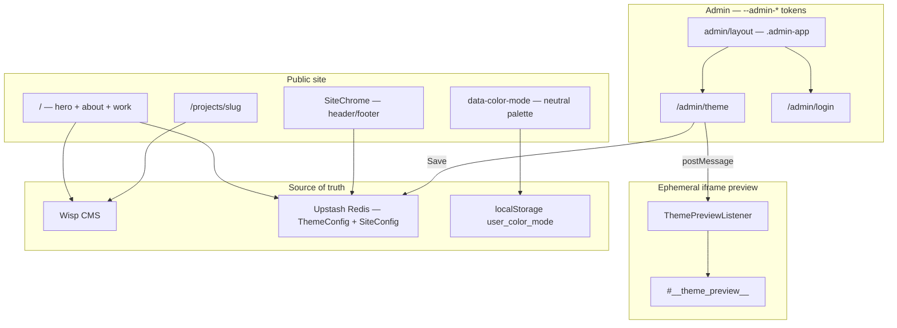

# Portfolio — Next.js, Wisp CMS & Julia Design System

A personal portfolio that doubles as a **technical case study**: semantic CSS architecture, headless CMS integration, visual admin editing, and production-grade resilience — **with zero Tailwind** anywhere in the codebase.

---

## What this project demonstrates

| Skill | How it's shown |
|-------|----------------|
| **CSS architecture** | HTML semântico + tokens CSS (`--grid-unit`, `color-mix()`) — no utility frameworks |
| **Design systems** | Shared scale (`--space-*`, `--type-*`, `--font-*`); 3-layer theming (visitor / preview / persist) |
| **Headless CMS** | Case studies from **Wisp CMS** (Server Components, ISR) |
| **Visual admin** | Static copy + theme editable via **Upstash Redis** — iframe preview is ephemeral until Save |
| **Components as data** | `data-editable` fields synced live in the admin iframe |

Live design system reference: [`/styleguide`](http://localhost:3000/styleguide) (ghost page, `noindex`).

---

## Architecture



### Hybrid data layer

**Volatile content (projects)** comes from Wisp CMS:

- Client singleton: `src/lib/wisp.ts`
- Resilient fetch layer: `src/lib/projects.ts`
- `getProjects()` — try/catch, empty state on failure
- `getProject(slug)` — React `cache()` deduplicates metadata + page fetch
- ISR: `revalidate = 60` (no Wisp webhooks documented)

**Structural config (theme + copy)** lives in Upstash Redis:

- Types & defaults: `src/lib/redis.ts`
- Server Actions: `src/lib/actions.ts` — `saveTheme`, `saveConfig`, `revalidatePath("/", "layout")`
- Editable via `/admin/theme` without a new build

Fields with `data-editable` map to `SiteConfig` keys (`heroTitle`, `workSectionTitle`, `footerText`, etc.).

---

## Three-layer theming

Same spatial/typographic scale everywhere. Different persistence per layer.

| Layer | Mechanism | Persists? |
|-------|-----------|-----------|
| **Visitor** | `ThemeSwitcher` → `[data-color-mode]` | Yes — `localStorage` (`user_color_mode`) |
| **Admin iframe preview** | `THEME_PREVIEW` postMessage → `#__theme_preview__` | **No** — refresh restores server state |
| **Admin Save** | `saveTheme` + `saveConfig` → Redis | **Yes** — source of truth |

Public site uses a **neutral monochrome** palette (Raster-like). Colorful theme presets are demonstrated in the admin iframe preview; only **Save** writes to Redis.

Admin panel chrome uses separate **`--admin-*`** tokens (dark shell). Login and ThemeEditor share the site's `--space-*` and `--type-*` scale.

---

## Julia Design System

The entire surface is **HTML + `globals.css` tokens** — inspired by [Raster](https://rsms.me/raster/) (declarative grid, harmonic scale, pure CSS).

| Layer | File | Role |
|-------|------|------|
| Atomic scale | `globals.css` §1 | `--grid-unit: 8px` → `--space-*`, `--type-*` |
| Color mode | §1 + `color-mode.ts` | `[data-color-mode="light\|dark"]` — neutral public palette |
| Responsive grid | §2, §4 | `.julia-grid` + `--grid-template` (4→8→12 cols) |
| Layout | §5–7 | `.site-header`, `.site-footer`, `.nav-item` |
| Public components | §11 | `.hero-*`, `.project-card__*`, `.theme-switcher__*` |
| CMS prose | §8 | `.prose` — pure CSS (headings, lists, code, tables) |
| Admin | Admin block | `.admin-*`, `--admin-bg`, `.admin-editor`, etc. |

**No Tailwind** — removed from dependencies. Wisp content uses class `.prose` styled entirely in CSS.

Theme presets for admin preview: `src/lib/theme-presets.ts`.

---

## Admin live-preview

Preview runs in an iframe pointing at `/`. `/admin/*` routes skip public header/footer (`middleware.ts` + `SiteChrome`).

```
ThemeEditor (parent)
  ├─ postMessage THEME_PREVIEW   → injects #__theme_preview__ (ephemeral)
  ├─ postMessage CONTENT_PREVIEW → updates [data-editable] fields
  ├─ postMessage SYNC_STATE      → restores sidebar state on navigation
  └─ listens CONTENT_CHANGE      ← iframe edits flow back to sidebar

ThemePreviewListener (iframe only)
  ├─ sets data-env="admin" on <html>
  ├─ contentEditable on [data-editable]
  ├─ MutationObserver for client navigations
  └─ posts IFRAME_READY on mount → parent re-sends preview
```

**Refresh iframe** = back to server-rendered state. **Save** = Redis + revalidate.

Public visitors: `ThemeSwitcher` sets `data-color-mode` (System / Light / Dark) via `src/lib/color-mode.ts`.

---

## Resilience & performance

| Concern | Solution |
|---------|----------|
| Wisp API down | `#work` empty state; no 500 on home |
| Offline / failed build SSG | `generateStaticParams` returns `[]` (no phantom routes) |
| Duplicate fetches | `cache(getProject)` in `projects.ts` |
| Stale CMS content | ISR 60s + manual **Republicar conteúdo Wisp** in admin |
| Missing blog ID | Warn in dev; degrade gracefully |

---

## SEO

- `NEXT_PUBLIC_SITE_URL` for canonical URLs (falls back to `VERCEL_URL` / localhost)
- `src/lib/metadata.ts` — Open Graph, Twitter cards, canonical
- JSON-LD `CreativeWork` on `/projects/[slug]`
- Home OG from Redis `SiteConfig`

---

## Routes

| Route | Purpose |
|-------|---------|
| `/` | One-page portfolio (hero, `#about`, `#work`) |
| `/projects/[slug]` | Case study detail |
| `/blog/:slug` | 301 → `/projects/:slug` |
| `/about` | Redirect → `/#about` |
| `/styleguide` | Internal design system docs |
| `/admin/login` | Admin auth |
| `/admin/theme` | Visual editor |

---

## Getting started

```bash
npm install
npm run dev
```

Open [http://localhost:3000](http://localhost:3000).

### Environment variables

```bash
# Wisp CMS
NEXT_PUBLIC_WISP_BLOG_ID=

# Upstash Redis
KV_REST_API_URL=
KV_REST_API_TOKEN=

# Admin (required in production)
ADMIN_PASSWORD=

# SEO (recommended in production)
NEXT_PUBLIC_SITE_URL=https://your-domain.com
```

**`ADMIN_PASSWORD`:** optional in dev (defaults to `admin123`); **required** in production — login is rejected if unset when `NODE_ENV=production`.

---

## Key files

| File | Role |
|------|------|
| `src/app/globals.css` | Design system source of truth (public + admin + prose) |
| `src/app/layout.tsx` | Root layout — fonts, color-mode script, conditional `SiteChrome` |
| `src/middleware.ts` | Pathname header — admin routes skip public chrome |
| `src/components/SiteChrome.tsx` | Header, main, footer wrapper |
| `src/app/admin/layout.tsx` | `.admin-app` shell |
| `src/lib/color-mode.ts` | Public color mode (System / Light / Dark) |
| `src/lib/projects.ts` | Wisp fetch layer + `cache()` |
| `src/lib/metadata.ts` | OG, Twitter, JSON-LD helpers |
| `src/lib/theme-presets.ts` | Theme presets for admin preview |
| `src/lib/theme-utils.ts` | `generateThemeCssVariables()` — iframe-scoped |
| `src/components/ThemePreviewListener.tsx` | Admin iframe bridge |
| `docs/HANDOFF.md` | Full architecture, history & checklist |
| `docs/CONTENT-PLAYBOOK.md` | **Checklist conteúdo real** (copy, Wisp, mídia) |
| `docs/WISP-POST-DRAFTS.md` | Rascunhos dos case studies para o CMS |

---

## Commands

```bash
npm run dev
npm run build
npm run lint
```

## Deploy on Vercel

Standard Next.js deployment. Configure all env vars for Production — especially `ADMIN_PASSWORD`, Redis credentials, and `NEXT_PUBLIC_SITE_URL`.

Built as a portfolio that explains its own engineering decisions.
