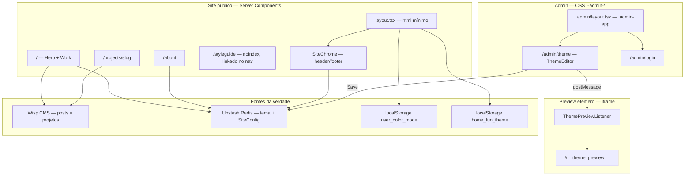

# Handoff — Portfolio Wisp + Julia Design System

Documento de continuidade para retomar melhorias em uma **nova conversa** sem perder contexto.  
Leia este arquivo inteiro antes de implementar qualquer task.

---

## Conteúdo real (copy + Wisp)

**→ Comece por [`docs/CONTENT-PLAYBOOK.md`](./CONTENT-PLAYBOOK.md)** — checklist master para não esquecer nada.

| Doc | Conteúdo |
|-----|----------|
| [CONTENT-PLAYBOOK.md](./CONTENT-PLAYBOOK.md) | Checklist fases 0–4, ordem Auway → … |
| [CONTENT-STRATEGY.md](./CONTENT-STRATEGY.md) | Estratégia, tiers, tom de voz, SiteConfig §6 |
| [WISP-POST-DRAFTS.md](./WISP-POST-DRAFTS.md) | Posts prontos para colar no Wisp |
| [REFERENCES.md](./REFERENCES.md) | Tokens DTCG, W3C DS/API, colors — mapa refs → entregas do repo |
| [CLEANUP-AUDIT.md](./CLEANUP-AUDIT.md) | Plano limpeza + audit W3C-first + produto (D) + docs GitHub (E) |
| [DEV-SECRETS.md](./DEV-SECRETS.md) | Easter eggs (`__julia`, Konami) |
| [`src/lib/redis.ts`](../src/lib/redis.ts) | Defaults de copy (`DEFAULT_SITE_CONFIG`) |

---

## Como usar em uma nova conversa

Cole no início do chat:

```
Estou continuando o refactor do meu portfólio Next.js + Wisp CMS.
Leia docs/HANDOFF.md e implemente [task específica].
Stack: HTML + CSS puro com tokens (Julia-Grid). Tailwind removido — zero utilities em todo o repo.
```

Substitua pela task desejada (ex.: conteúdo Wisp, `#contact`, CI strict).

---

## Objetivo do projeto

Site de **portfólio pessoal** que demonstra habilidades técnicas:

| Demonstração | Como |
|--------------|------|
| CSS arquitetural | HTML semântico + tokens CSS (`--grid-unit`, `color-mix()`) — **zero Tailwind** em todo o repo |
| Design system | Escala compartilhada (`--space-*`, `--type-*`, `--font-*`); visitante troca **color mode** via `ThemeSwitcher` |
| CMS headless | Projetos/case studies vêm do **Wisp CMS** |
| Admin visual | Conteúdo estático + tema editáveis via **Upstash Redis**; preview no iframe é **efêmero** até Salvar |
| Components as data | Campos com `data-editable` editáveis no iframe do admin |

**Referência de grid:** [Raster](https://rsms.me/raster/) — grid declarativo, escala harmônica, CSS puro.

---

## Arquitetura de dados



### Wisp CMS (conteúdo dinâmico)

- Cliente: `src/lib/wisp.ts` — `buildWispClient({ blogId })`
- Env: `NEXT_PUBLIC_WISP_BLOG_ID`
- Docs: https://www.wisp.blog/docs
- **Sem webhooks documentados** — usar `revalidate = 60` (ISR) é suficiente para portfólio
- Campos usados: `title`, `slug`, `description`, `image`, `content`, `publishedAt`, `tags`
- Fetch apenas em Server Components (sem API routes)

### Redis (conteúdo estático + tema padrão)

- `src/lib/redis.ts` — tipos `ThemeConfig`, `SiteConfig`
- `src/lib/actions.ts` — `getTheme`, `saveTheme`, `getConfig`, `saveConfig` + `revalidatePath("/", "layout")`
- Env: `KV_REST_API_URL`, `KV_REST_API_TOKEN`, `ADMIN_PASSWORD`

### SiteConfig (campos editáveis)

| Campo | data-editable | Onde aparece |
|-------|---------------|--------------|
| `siteName` | `siteName` | Header |
| `siteDescription` | — | Metadata |
| `heroTitle` | `heroTitle` | Home |
| `heroDescription` | `heroDescription` | Home |
| `aboutTitle` | `aboutTitle` | `/about` |
| `aboutIntro` | `aboutIntro` | `/about` |
| `aboutBody` | `aboutBody` | `/about` |
| `workSectionTitle` | `workSectionTitle` | Work `#work` |
| `workSectionIntro` | `workSectionIntro` | Work intro |
| `footerText` | `footerText` | Footer |

Copy padrão: [`redis.ts`](../src/lib/redis.ts) · guia completo: [CONTENT-PLAYBOOK.md](./CONTENT-PLAYBOOK.md)

---

## Camadas de theming (visitante + Fun + admin)

Mesma escala espacial/tipográfica (`--space-*`, `--type-meta`, `--font-*`). Persistência diferente por camada.

| Camada | Mecanismo | Persistência | Objetivo |
|--------|-----------|--------------|----------|
| **Visitante — Core** | `[data-color-mode]` via `ThemeSwitcher` | `localStorage` → `user_color_mode` | System / Light / Dark — paleta neutra |
| **Visitante — Fun** | `[data-fun-theme]` via `ThemeSwitcher` | `localStorage` → `home_fun_theme` | Electric / Neon / Signal / Albers — só `/` e `/styleguide` |
| **Preview (iframe)** | `#__theme_preview__` via `THEME_PREVIEW` postMessage | **Nenhuma** — refresh restaura servidor | Demonstrar que o design system responde ao vivo |
| **Admin Save** | `saveTheme` + `saveConfig` → Redis | **Fonte da verdade** | Conteúdo estático + estilização persistida |

### Visitante (público)

- `src/lib/color-mode.ts` — `applyColorMode()`, init script no `<head>` (também restaura Fun se o path permitir)
- `src/lib/fun-themes.ts` — pares Fun + `pathAllowsFunThemes`
- Tokens neutros em `globals.css`: `:root[data-color-mode="light|dark"]`
- Fun themes: `:root[data-fun-theme="…"]` (home/styleguide)
- **Sem** inline CSS vars no `<html>` — color mode / Fun vêm do CSS + script
- Tipografia pública: **Inter** sempre (`--font-body` / `--font-display`); mono só em `code`
- Focus do switcher: bloco invertido no face `theme: value ▼`

### Preview (iframe admin)

- `ThemePreviewListener` — só ativo quando `window.self !== window.top`
- Seta `data-env="admin"` no `<html>` do iframe
- `generateThemeCssVariables()` em `theme-utils.ts` — escopado a `html[data-env="admin"]`
- Alterações de cor/raio/fonte + `CONTENT_PREVIEW` são locais à sessão do iframe
- **Salvar** no admin → Redis + `revalidatePath` = única persistência oficial

### Admin chrome (`--admin-*`)

- Rotas `/admin/*` **não** recebem header/footer público (`middleware.ts` + `SiteChrome` condicional)
- `src/app/admin/layout.tsx` — wrapper `.admin-app`
- Login + ThemeEditor: classes `.admin-*` — **zero Tailwind**
- Cores do painel: `--admin-bg`, `--admin-surface`, `--admin-text`, etc. (escuro fixo)
- Escala compartilhada com o site: `--space-*`, `--type-*`, `--font-*`

---

## Design system — regras (não negociáveis)

1. **UI pública + admin:** HTML semântico + classes de `globals.css` — **zero Tailwind** (removido do projeto)
2. **Tokens de espaço:** `--grid-unit: 8px` → `--space-1` … `--space-12` — compartilhados site + admin
3. **Color mode público:** `[data-color-mode]` no `<html>` — neutro monocromático (Raster-like)
4. **Tema colorido (preview):** injetado só no iframe via `#__theme_preview__` — efêmero até Salvar
5. **Tema persistido:** Redis (`ThemeConfig`) — aplicado após Save; chave `site_theme`
6. **Cores derivadas** (nunca hardcoded na UI pública): `--border`, `--muted`, `--muted-foreground` via `color-mix()`
7. **Grid:** `.julia-grid` + `--grid-template` + `.julia-item` / `.julia-subgrid`
8. **Admin chrome:** tokens `--admin-*` — independentes do color mode público
9. **ThemeSwitcher:** Core (System / Light / Dark → `user_color_mode`) + Fun (`home_fun_theme`, só home/styleguide). Não altera a paleta colorida do Redis admin.
10. **Prose Wisp:** class `.prose` — CSS puro em `globals.css` §8

### Mapa do `globals.css`

| Seção | Conteúdo |
|-------|----------|
| §1 | Tokens atômicos + spacing + tipografia |
| §2 | Breakpoints grid (4 → 8 → 12 cols) |
| §4 | Julia-Grid core |
| §5–7 | Layout semântico, links, base |
| §8 | `.prose` (Wisp CMS — CSS puro) |
| §9 | Utilitários spacing (`.padding-md`, etc.) |
| §10 | Style guide (`.sg-*`) |
| §11 | UI pública (hero, project-card, theme-switcher) |
| **Admin** | `.admin-*` — login, ThemeEditor, tokens `--admin-*` |

### Style guide vivo

- URL: **`/styleguide`** (`noindex`, **linkado** no nav como “style guide”)
- Arquivos: `src/app/styleguide/page.tsx`, `layout.tsx`, `StyleguideThemeBoard`
- Documentação visual do design system + board de tema ativo (lean / randoma11y-style)

---

## IA atual (código)

```
/                     Hero (3D + whoami→/about) + Work (#work)
/about                Página About (SiteConfig)
/projects/[slug]      Detalhe do case study
/styleguide           Design system docs (noindex, no nav)
/resume/*.html        CV estático EN/PT
/admin/theme          Editor visual
/blog/:slug           301 → /projects/:slug
```

**Navegação no header (`SiteChrome`):**
- Logo → `/`
- work → `/#work` · about → `/about` · cv → resume EN · style guide → `/styleguide`
- ThemeSwitcher — face `theme: value ▼` (Core + Fun onde permitido)

**Decisão About (C2-A):** rota `/about` mantida — **não** redirect para `/#about`.

---

## Estado atual

| Área | Estado |
|------|--------|
| Home | ✓ Hero 3D + Work (`#work`) — sem About embutido |
| About | ✓ Página `/about` (não redirect) |
| Detalhe | ✓ `/projects/[slug]` + tokens + JSON-LD |
| Preview admin | ✓ `ThemePreviewListener` — preview efêmero + Save → Redis |
| Color mode | ✓ System / Light / Dark via `color-mode.ts` |
| Fun themes | ✓ Electric / Neon / Signal / Albers — home + styleguide |
| Hero cursor | ✓ whoami PNG → `/about` (click vs drag) |
| Admin CSS | ✓ Login + ThemeEditor em `.admin-*` — zero Tailwind |
| Tailwind | ✓ **Removido** — `.prose` em CSS puro |
| Layout admin | ✓ `/admin/*` sem chrome público (`middleware` + `SiteChrome`) |
| Wisp fetch | ✓ `src/lib/projects.ts` + `cache()` |
| SEO | ✓ `metadata.ts` + OG + canonical |
| Styleguide | ✓ Linkado no nav + theme board |
| Toolchain | ✓ ESLint OK, package `julia-portfolio` |

**Refatoração PR-1 → PR-6 + migração CSS pura concluída.** Backlog atual: [`CLEANUP-AUDIT.md`](./CLEANUP-AUDIT.md) (Fases 0/A/B/C/D/E).

---

## O que já foi feito

- [x] PR-1 — Consolidação CSS (`ProjectCard`, `theme-presets`, ThemeSwitcher tokenizado)
- [x] PR-2 — Rotas `/projects/[slug]` + home Hero+Work (About virou página própria depois)
- [x] PR-3 — Admin preview unificado (`ThemePreviewListener`)
- [x] PR-4 — Camada de dados Wisp (`projects.ts`, empty state, `cache()`)
- [x] PR-5 — SEO mínimo (`metadata.ts`, JSON-LD)
- [x] Polish final — deps Shadcn removidas, package `julia-portfolio`, route group `(site)`, ESLint fix
- [x] `/styleguide` com documentação viva do design system (linkado no nav)
- [x] **Migração CSS pura** — admin (`--admin-*`), ThemeEditor, login, `.prose` Wisp
- [x] **Tailwind removido** — `tailwindcss`, `@tailwindcss/typography`, `@tailwindcss/postcss`
- [x] **Theming visitante** — Core color-mode + Fun themes (`fun-themes.ts`)
- [x] **`color-mode.ts`** — System/Light/Dark + init script; limpeza de inline vars legadas
- [x] **`SiteChrome`** + `middleware.ts` — admin isolado do header/footer público
- [x] **Hero 3D** + cursor whoami → `/about`
- [x] **ThemeSwitcher** face + focus invertido

---

## Roadmap — PRs sugeridos

Implementar **na ordem**. Cada PR = uma conversa possível.

---

### PR-1 — Consolidação CSS (PRIORIDADE IMEDIATA)

**Objetivo:** UI pública 100% tokenizada. Referência: `/styleguide`.

#### Tasks

- [x] **1.1** Adicionar classes semânticas em `globals.css` §11
- [x] **1.2** Migrar `src/app/(blog)/page.tsx`
- [x] **1.3** Criar `src/components/ProjectCard.tsx`
- [x] **1.4** Substituir `<a href>` por `Link` do Next.js nos cards
- [x] **1.5** Migrar `ThemeSwitcher.tsx` para CSS puro
- [x] **1.6** Extrair `src/lib/theme-presets.ts`
- [x] **1.7** Deletar `BlogPostCard.tsx`

#### Critérios de aceite

- Home sem `style={{ ... }}` (exceto `--grid-template` no grid container)
- Nenhuma className Tailwind utility nas pages públicas alteradas
- ThemeSwitcher visualmente igual ou melhor, só com tokens
- `/styleguide` continua funcionando

#### Arquivos principais

```
src/app/globals.css
src/app/(blog)/page.tsx
src/components/ProjectCard.tsx        (novo)
src/components/ThemeSwitcher.tsx
src/lib/theme-presets.ts              (novo)
src/app/admin/(protected)/theme/ThemeEditor.tsx
```

---

### PR-2 — Rotas de projeto + home (histórico)

**Objetivo original:** one-page; **resultado atual:** home Hero+Work; About em `/about` (C2-A).

#### Tasks (histórico)

- [x] **2.1** About na home como `#about` — **superseded:** página `/about`
- [x] **2.2** Rota `/projects/[slug]`
- [x] **2.3** Redirect `/blog/[slug]` → `/projects/[slug]`
- [x] **2.4** Header: work / about / cv / style guide (não só âncoras)
- [x] **2.5** ~~Redirect `/about` → `/#about`~~ — **não feito;** `/about` é página real
- [x] **2.6** Página de projeto tokenizada
- [x] **2.7** Tags como `.project-tag`

#### Critérios de aceite (atualizados)

- `/` contém hero + work; `/about` é rota própria
- Detalhe de projeto em `/projects/[slug]`

#### Arquivos principais (hoje)

```
src/app/(site)/page.tsx
src/app/(site)/about/page.tsx
src/app/projects/[slug]/page.tsx
src/components/SiteChrome.tsx
```

---

### PR-3 — Admin e preview unificado

**Objetivo:** Edição visual confiável no iframe.

#### Tasks

- [x] **3.1** `ThemePreviewListener` integrado no layout
- [x] **3.2** Script inline removido
- [x] **3.3** `workSectionTitle`, `workSectionIntro` no SiteConfig
- [x] **3.4** `wisp_content_cache` removido
- [x] **3.5** `ADMIN_PASSWORD` documentado

#### Arquivos principais

```
src/app/layout.tsx
src/components/ThemePreviewListener.tsx
src/app/admin/(protected)/theme/ThemeEditor.tsx
src/lib/redis.ts
```

---

### PR-4 — Camada de dados Wisp

**Objetivo:** Resiliência + performance.

#### Tasks

- [x] **4.1** `src/lib/projects.ts`
- [x] **4.2** `getProject` em metadata + page
- [x] **4.3** Empty state em `#work`
- [x] **4.4** `generateStaticParams` → `return []`
- [x] **4.5** Tipos de `@wisp-cms/client`
- [x] **4.6** Validação `NEXT_PUBLIC_WISP_BLOG_ID`

#### Arquivos principais

```
src/lib/projects.ts                   (novo)
src/lib/wisp.ts
src/app/projects/[slug]/page.tsx
src/app/(blog)/page.tsx
```

---

### PR-5 — SEO mínimo (portfólio)

#### Tasks

- [x] **5.1** `NEXT_PUBLIC_SITE_URL`
- [x] **5.2** `src/lib/metadata.ts`
- [x] **5.3** JSON-LD `CreativeWork`
- [x] **5.4** OG na home

---

### PR-6 — Cleanup + README case study

#### Tasks

- [x] **6.1** Removidos: `Header.tsx`, `Footer.tsx`, `ui/button.tsx`, `lib/utils.ts`, `components.json`
- [x] **6.2** `ThemePreviewListener` mantido e integrado (não deletar)
- [x] **6.3** README case study técnico
- [x] **6.4** Botão "Republicar conteúdo Wisp" no admin

---

## Decisões (resolvidas vs pendentes)

| # | Tema | Decisão |
|---|------|--------|
| 1 | Rota de detalhe | `/projects/[slug]` ✓ |
| 2 | About | **Página `/about`** (C2-A) — não merge `/#about` |
| 3 | Naming | `project` na UI; Wisp ainda usa posts por baixo |
| 4 | Home | Hero + Work; About separado |
| 5 | Build strict | Pendente — hoje degrada sem `WISP_BLOG_ID` |

---

## Problemas conhecidos

| Problema | Status |
|----------|--------|
| Build strict sem `WISP_BLOG_ID` | Decisão pendente — hoje degrada graciosamente |
| Nav mobile | Pendente — [`CLEANUP-AUDIT.md`](./CLEANUP-AUDIT.md) **D1** |
| HANDOFF/README drift | **C0 feito** (set/2026) |

---

## Assets 3D (hero + reserva About)

| Asset | Uso | Fonte local | No repo |
|-------|-----|-------------|---------|
| **`working.glb`** | **Home hero** — estático, sem animação skeletal | `~/Downloads/working.glb` (~28 MB export) | `public/models/hero.glb` após `npm run models:optimize` (~1,6 MB Draco, set/2026) |
| **`dancing.glb`** | **Reserva P3** — personagem animado na **About** (se sobrar tempo) | `~/Downloads/dancing.glb` (~19 MB) | Não commitado ainda — otimizar antes de `public/models/dancing.glb` |

**Pipeline:** export Blender → copiar para `public/models/hero.glb` → `npm run models:optimize` → testar `HeroModelViewer` (sem `auto-rotate`; drag orbit; whoami cursor → `/about`).

**Ideia About (Julia, 12/09):** viewer com clip de dança, só desktop / `prefers-reduced-motion: no`; mobile = poster — ainda opcional.

**Decisão UI (16–17/09):** ThemeSwitcher Core + Fun + focus invertido. Admin permanece. Home = Hero + Work; About = `/about`. Cursor whoami shipped.

**UI híbrida:** WOUQ chrome + cards no Julia Grid. Home usa `--container-max-width` (1200). Hero: tagline + 3D. Backlog produto: nav mobile, i18n, perf — ver CLEANUP-AUDIT Fase D.

---

## Próximos passos opcionais

- Plano ativo: [`docs/CLEANUP-AUDIT.md`](./CLEANUP-AUDIT.md) — próximo produto **D1 nav mobile**; docs GitHub **E1**
- Conteúdo real: [`docs/CONTENT-PLAYBOOK.md`](./CONTENT-PLAYBOOK.md) — Auway primeiro no Wisp
- Adicionar seção `#contact`
- Falhar CI sem `WISP_BLOG_ID` (modo strict)
- Aplicar `ThemeConfig` do Redis no site público (hoje: neutro + Fun + preview no iframe)
- **P3:** `dancing.glb` animado na About (ver tabela acima)
- Hero scroll 3D (GSAP + yaw) — quando autorizar `pode executar hero-scroll-3d`

---

## Variáveis de ambiente

```bash
# Wisp CMS
NEXT_PUBLIC_WISP_BLOG_ID=

# Upstash Redis
KV_REST_API_URL=
KV_REST_API_TOKEN=

# Admin
ADMIN_PASSWORD=          # obrigatório em prod (default dev: admin123)

# SEO (PR-5)
NEXT_PUBLIC_SITE_URL=    # ex: https://meusite.com
```

---

## Comandos úteis

```bash
npm run dev          # http://localhost:3000
npm run build
npm run lint

# Páginas importantes
open http://localhost:3000/styleguide   # design system
open http://localhost:3000/admin/theme # editor
```

---

## Índice de arquivos-chave

| Arquivo | Papel |
|---------|-------|
| `src/app/globals.css` | **Fonte da verdade** do design system (público + admin + prose) |
| `src/app/layout.tsx` | Root mínimo: fonts, color-mode script, `SiteChrome` condicional |
| `src/middleware.ts` | Header `x-pathname` — omite chrome público em `/admin/*` |
| `src/components/SiteChrome.tsx` | Header + main + footer (só rotas públicas) |
| `src/app/admin/layout.tsx` | Wrapper `.admin-app` |
| `src/lib/color-mode.ts` | Color mode público + init script (+ Fun path gate) |
| `src/lib/fun-themes.ts` | Fun themes Core+Fun (ids, CSS vars, storage) |
| `src/app/(site)/page.tsx` | Home (hero 3D + work) |
| `src/app/(site)/about/page.tsx` | About |
| `src/app/projects/[slug]/page.tsx` | Detalhe do case study |
| `src/app/styleguide/page.tsx` | Docs vivas — referência visual |
| `src/components/ThemeSwitcher.tsx` | Core + Fun — face `theme: value ▼` |
| `src/components/HeroVisual.tsx` | Hero 3D + whoami → `/about` |
| `src/components/ThemePreviewListener.tsx` | Bridge iframe — preview efêmero |
| `src/components/wisp-content-wrapper.tsx` | Render HTML Wisp (client, `.prose`) |
| `src/lib/wisp.ts` | Cliente Wisp singleton |
| `src/lib/redis.ts` | Tipos + defaults tema/config (**copy SiteConfig**) |
| `src/lib/actions.ts` | Server actions Redis + revalidate |
| `src/lib/theme-utils.ts` | `generateThemeCssVariables()` — escopo iframe |
| `src/app/admin/(protected)/theme/ThemeEditor.tsx` | Admin visual (CSS `.admin-*`) |
| `next.config.ts` | `imagedelivery.net` em `remotePatterns` |

---

## Equivalência Raster ↔ Julia-Grid

| Raster | Julia-Grid |
|--------|------------|
| `<r-grid columns=8>` | `.julia-grid` + `--grid-columns` (responsive) |
| `<r-cell span=2-5>` | `.julia-item` + `--grid-template` no pai |
| `columns-s`, `span-s` | Media queries em `:root` (4→8→12 cols) |
| `.debug` | `.julia-grid.debug` |
| `--lineHeight` como unidade | `--grid-unit: 8px` como unidade |
| `--fontSize` muda escala toda | `--space-*` muda spacing; tipo via classes |

---

## Próximo passo recomendado

**C0 feito.** Seguinte: [`docs/CLEANUP-AUDIT.md`](./CLEANUP-AUDIT.md) — **D1** nav mobile (ou **E2** stubs de DESIGN-SYSTEM/TESTING).

Conteúdo real: [`docs/CONTENT-PLAYBOOK.md`](./CONTENT-PLAYBOOK.md).

Melhorias opcionais: [Próximos passos opcionais](#próximos-passos-opcionais) e [Problemas conhecidos](#problemas-conhecidos).

---

*Última atualização: migração CSS pura — admin `--admin-*`, 3 camadas de theming, Tailwind removido, styleguide atualizado.*
