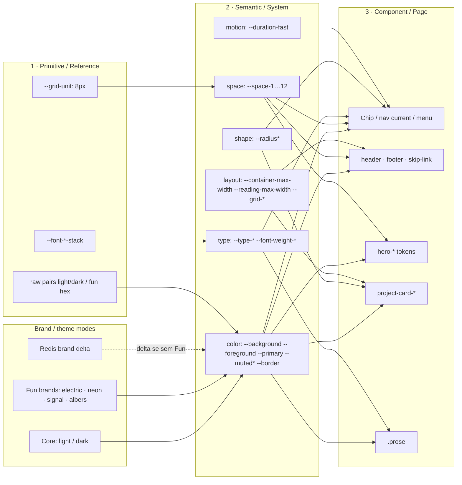
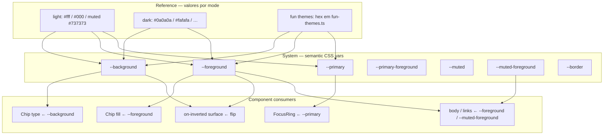
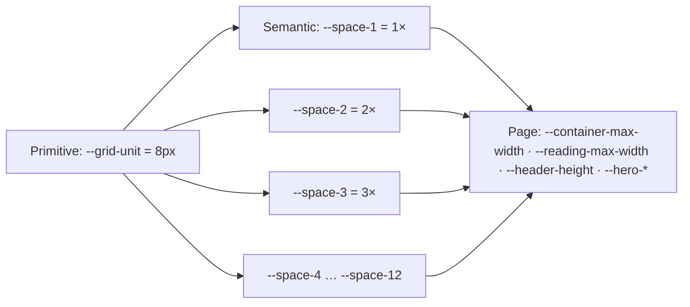
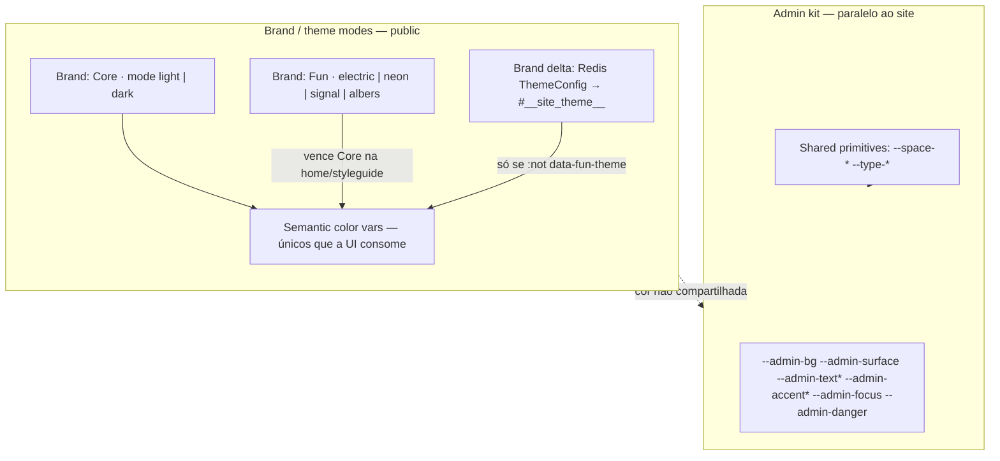
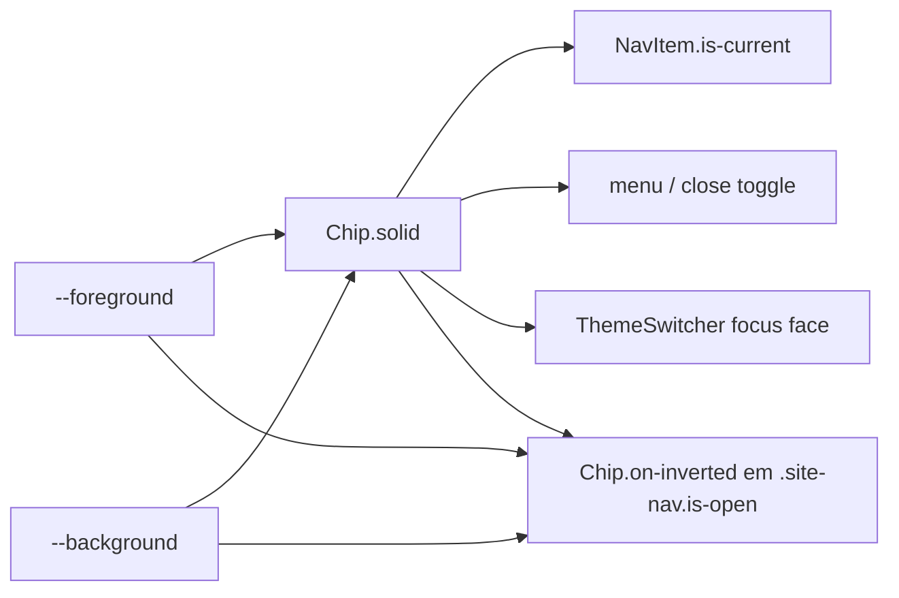

# Mapa de tokens — taxonomia in-repo

Complementa [`COMPONENT-INVENTORY.md`](./COMPONENT-INVENTORY.md).

**Propósito multi-brand / multi-theme:** a UI pública consome **só semantic tokens**; trocar de “marca” = trocar o **mode** que alimenta esses aliases (Core light/dark, Fun themes, ou delta Redis). É a mesma disciplina Vodafone/Material — escala de portfólio, não fork por marca.

Mermaid no espírito de:

- [Material tokens overview](https://github.com/material-foundation/material-tokens/blob/main/tokens.md#tokens-overview) (Reference → System)
- [Vodafone UK — Figma Variables taxonomy](https://medium.com/vodafone-uk-design-experience/figma-variables-at-vodafone-uk-how-we-structured-taxonomy-for-a-complex-multi-brand-design-system-693b1b95675f) (Primitives → Semantic → Page / **brand modes**)
- [UX Collective — Variables](https://uxdesign.cc/design-system-figma-variables-f3d9c4351bcc) (estrutura sem vazar NDA)
- [DTCG Format](https://www.designtokens.org/tr/2025.10/format/)

Fonte de verdade no código: `src/app/globals.css`, `src/lib/fun-themes.ts`, `#__site_theme__` (Redis), `--admin-*`.

---

## Modelo mental (3 camadas + modes)

| Camada (nosso nome) | Analogia Material | Analogia Vodafone | O que é aqui |
|---------------------|-------------------|-------------------|--------------|
| **Primitive / Reference** | `md.ref` | Brand / Brand Primitives | Valores brutos ou âncoras (`--grid-unit`, ramps implícitas light/dark) |
| **Semantic / System** | `md.sys` | Semantic Collection | Papel na UI: `--background`, `--foreground`, `--space-3`, `--type-body` |
| **Component / Page** | (uso em componentes) | Page Collection | Chip, hero, project-card, header blur — consomem semantic |

**Modes** (= collection modes / “brands” na taxonomia Vodafone — aqui cada theme é um mode):

| Mode (brand/theme) | Mecanismo | Troca o quê |
|--------------------|-----------|-------------|
| Core Light / Dark | `[data-color-mode]` | Semantic color (marca neutra do site) |
| Fun: Electric, Neon, Signal, Albers | `[data-fun-theme]` — `/` e `/styleguide` | Semantic color (outras “marcas” / skins) |
| Redis theme | `#__site_theme__` — cede a Fun | Semantic color (delta admin / brand custom) |
| Admin | `--admin-*` + `data-env="admin"` | Kit **paralelo** do painel (não é brand do site público) |

Componentes (Chip, nav, prose…) **não** conhecem o nome do theme — só `--background` / `--foreground` / etc. Por isso dá para ser multi-brand sem fork de componentes.

---

## Overview — fluxo de aliases

---

## Color — Reference → System (estilo Material, enxuto)

Hoje **não** há rampa `neutral-10…100` nomeada: light/dark (e Fun) **escrevem direto** nos semantic. O diagrama abaixo mostra o *papel* desejado + o que o código faz agora.

**Gap (futuro E3):** introduzir primitives nomeadas (`--color-neutral-0` …) e fazer semantic **alias** — aí o Mermaid fica idêntico ao Material (`sys --Light--> ref`). Hoje o alias está “achatado”.

---

## Space — Primitive → Semantic → Page

---

## Modes = brands (Vodafone “collections”, nossa escala)

Trocar Fun theme ≈ trocar VOXI ↔ Vodafone no artigo: **mesmo Chip / NavItem**, novos valores nos aliases.

---

## Inventário rápido por grupo

### Primitive / shared (`:root`)

| Token | Papel |
|-------|--------|
| `--grid-unit` | Âncora de espaço |
| `--font-sans-stack`, `--font-mono-stack` | Stacks |
| `--font-body`, `--font-display` | Alias tipográficos |
| `--grid-columns`, `--julia-gap`, `--grid-template` | Grid defaults |

### Semantic — color (modes)

| Token | Papel |
|-------|--------|
| `--background`, `--foreground` | Superfície / texto |
| `--primary`, `--primary-foreground` | Ênfase / on-primary |
| `--muted`, `--muted-foreground` | Quiet UI |
| `--border` | Contorno |

### Semantic — space / type / shape / motion

| Grupo | Tokens |
|-------|--------|
| Space | `--space-1` … `--space-12` |
| Type | `--type-hero*`, `--type-display`, `--type-heading`, `--type-subheading`, `--type-lead`, `--type-body`, `--type-meta`, `--type-caption`, `--font-weight-*` |
| Shape | `--radius`, `--radius-card`, `--radius-card-hover` |
| Motion | `--duration-fast` |
| Layout | `--container-max-width`, `--reading-max-width`, `--header-height` |

### Component / page

| Grupo | Tokens (exemplos) |
|-------|-------------------|
| Header | `--header-blur-*`, `--header-tint` |
| Hero | `--hero-height*`, `--hero-model-*`, `--hero-bob-*`, `--hero-load-*` |
| Project card | `--project-card-aspect*`, `--project-card-label-invert`, `--project-card-image-scale-hover` |
| Chip (alvo P0) | consome `--foreground` / `--background` (+ flip on-inverted) — contrato [`chip.contract.json`](./contracts/chip.contract.json) |

### Admin (kit paralelo)

`--admin-bg`, `--admin-surface`, `--admin-border*`, `--admin-text*`, `--admin-accent*`, `--admin-danger`, `--admin-focus`

---

## Ligação com componentes (P0)

Ver checklist em [`COMPONENT-INVENTORY.md`](./COMPONENT-INVENTORY.md) e contrato em [`contracts/chip.contract.json`](./contracts/chip.contract.json) (Component Contracts → CSS primeiro; Figma opcional).

---

## Próximos passos (tokens)

1. Manter este mapa alinhado ao código (E3 / A4).
2. **W3** do [`UI-REFINEMENT-WORKFLOW.md`](./UI-REFINEMENT-WORKFLOW.md): revalidar com ledger + matriz de uso W2.
3. Opcional: primitives de cor nomeadas por brand/theme + semantic só com alias — T1.
4. Visual/CSS só após V1 + spike S1; specimen no `/styleguide` quando houver nome.
5. Themes = brand modes — confirmar em T2.

---

*Refs: [Material tokens.md](https://github.com/material-foundation/material-tokens/blob/main/tokens.md#tokens-overview) · [Vodafone UK Figma Variables](https://medium.com/vodafone-uk-design-experience/figma-variables-at-vodafone-uk-how-we-structured-taxonomy-for-a-complex-multi-brand-design-system-693b1b95675f) · [UX Collective — Variables (NDA-safe voice)](https://uxdesign.cc/design-system-figma-variables-f3d9c4351bcc) · DTCG Format*
