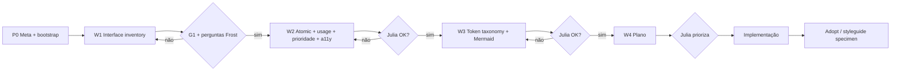

# UI refinement workflow

Workflow de **refinamento de UI** para este portfólio (style guide in-repo — não package DS).  
**Documento canônico** — checklist Frost, perguntas pós-inventário, prioridade Curtis, a11y, P0 meta e Adopt ficam aqui (evitar espalhar).

Agente: [`.cursor/skills/style-guide-review`](../.cursor/skills/style-guide-review/SKILL.md).  
Board: [`STYLE-GUIDE-REVIEW.md`](./STYLE-GUIDE-REVIEW.md).

**Ordem (DECIDED 2026-09-17):** páginas primeiro → atomic+usage → tokens/Mermaid → plano → **Adopt** (specimen).  
**Regra:** artefato + gate; Julia aprova; agente não implementa o plano sozinho.



**Refs de ordem:** [Frost inventory](https://bradfrost.com/blog/post/conducting-an-interface-inventory/) · [Curtis cut-up](https://nathanacurtis.substack.com/p/the-component-cut-up-workshop-1378ae110517) · [Smashing Atomic Workflow](https://www.smashingmagazine.com/2016/12/atomic-design-workflow/) · [Curtis token taxonomy](https://medium.com/eightshapes-llc/reimagining-a-token-taxonomy-462d35b2b033) · [designsystem.guide where to start](https://thedesignsystem.guide/where-to-start). Pedagogia tokens (W3): Vanilla + Vodafone — **não** copiar nomes.

---

## P0 — Meta + bootstrap

### P0.1 Meta (designsystem.guide — lite, solo)

Responder no board ou no topo do artefato W1 (2–5 min):

| # | Pergunta | Resposta (Julia) |
|---|----------|------------------|
| M1 | O style guide in-repo é **para quem**? (ex.: eu + recrutadores / só craft) | Para mim + portfólio. Quem aprofunda detalhes: designer / engenheiro (não recrutador genérico). |
| M2 | Sucesso desta revisão = o quê? (ex.: chrome consistente + tokens claros + specimen) | Fazer funcionar o suficiente para **publicar**. |
| M3 | O que **não** é objetivo agora? (ex.: package npm, multi-produto, Once UI) | Package npm **não** agora (provável semana que vem). Foco: refinar para **mostrar processo e lógica** — NDA impede falar dos trabalhos. |
| M4 | Público vs admin: kits **sempre** separados? (default: sim) | **Não** como meta de produto: um sistema; mais adiante **isolar** scopes para CSS não vazar. Isolamento formal → semana que vem (sem tempo agora). |

### P0.2 Bootstrap do agente

1. Ler este arquivo + board + `REFERENCES`.
2. Intent: `W1` \| `W2` \| `W3` \| `W4` \| Adopt \| pontual \| spike.
3. **button ≠ link ≠ select ≠ visual**; público ≠ `--admin-*`.
4. Sem fase → perguntar.

Não pular fases. Figma CC / contracts só pós-W3 + pedido.

### Governance (paralelo — Brad Frost FigJam)

[DS Governance Process](https://www.figma.com/board/1NGkfRVIwNoV7DKOkh8VRC/Design-System-Governance-Process--Community-):

```
Use → Talk → Design & Build → Release → Adopt
```

Happy path: **já existe?** → **cumpre requisitos?** → senão Talk (bug / discrepancy / feature → style guide vs **recipe/snowflake**).

---

## W1 — Interface inventory (páginas / telas)

**Objetivo:** o que a UI **mostra**. Demanda, não oferta de tokens.

**Refs:** [Conducting an Interface Inventory](https://bradfrost.com/blog/post/conducting-an-interface-inventory/) · [Atomic Workflow ch.4](https://atomicdesign.bradfrost.com/chapter-4/).

### Escopo de páginas

| Área | Rotas / superfícies |
|------|---------------------|
| Público | `/` (hero + work), `/about`, project detail, `/styleguide`, chrome (header/nav/theme/footer) |
| Admin | login, Theme editor (kit **A** — inventariar separado) |

### Checklist de categorias Frost

Marcar na captura (tratar **únicos**, não toda instância). Adaptar se vazio.

| Cat. | Inclui | ✓ |
|------|--------|---|
| **Global** | header, footer, skip-link, chrome compartilhado | |
| **Navigation** | nav links, menu/close, breadcrumbs, in-page anchors | |
| **Buttons** | submit, ghost, toggles que são `<button>` | |
| **Links** | chrome, prose, back, emphasis, logo-as-link | |
| **Forms / controls** | inputs, select (ThemeSwitcher), checkboxes… | |
| **Headings / type** | hero, section, lead, body, meta, caption | |
| **Blocks** | media+text clusters, cards simples | |
| **Lists** | work grid items, meta lists | |
| **Images / media** | hero 3D/poster, project thumbs, icons | |
| **Icons** | chevrons, social, spinners | |
| **Interactive** | accordion-like, tabs, mobile panel/backdrop | |
| **Messaging** | errors, empty states, status | |
| **Colors** | tratamentos de cor distintos (pairs, fills) — evidência visual, não taxonomia ainda | |
| **Animation / motion** | bob, transitions, loaders | |
| **3rd party** | embeds, se houver | |
| **Admin-only** | `.admin-*` (não misturar com público) | |

### Passos W1

1. Completar P0.1 se vazio.
2. Listar rotas.
3. Screenshot ou `página | seletor | descrição` por tratamento único.
4. Preencher categorias Frost (checklist acima).
5. Notar inconsistências óbvias (ex.: plaquinha ×3).

**Entregável:** `docs/INTERFACE-INVENTORY-W1.md`

Cols mínimas: `página | cat. Frost | padrão UI | elemento HTML | notes`

**Não fazer:** Mermaid tokens, renomear CSS, extrair Chip.

### G1 — Perguntas pós-inventário (Frost step 5)

Antes de W2, Julia responde (board ou rodapé do W1):

| # | Pergunta |
|---|----------|
| Q1 | Que **nomes** fixamos para os padrões mais confusos? (ex.: plaquinha / nav current) |
| Q2 | O que **fica** como está no curto prazo? |
| Q3 | O que deve **sumir** ou ser depreciado? |
| Q4 | O que dá para **merge** (mesmo padrão, N CSS)? |
| Q5 | Inventário de telas está completo o bastante para W2? (**gate**) |

---

## W2 — Atomic + uso de tokens + prioridade + a11y

**Objetivo:** cut-up Curtis + Atomic Design + matriz de tokens + flags de prioridade + smoke a11y.

### Níveis atomic

| Nível | Exemplos |
|-------|----------|
| Átomos | link, button, select, type roles |
| Moléculas | nav-item+current, theme face+select, skip-link |
| Organismos | SiteNav, header, Hero, ProjectCard |
| Templates/pages | home, about, project, styleguide, admin |
| Patterns | plaquinha fg/bg; focus outline |

### Prioridade Curtis (cut-up)

Cada linha do inventário leva **uma** flag (equilibrar — nem tudo “must”):

| Flag | Significado |
|------|-------------|
| **must** | Crítico para chrome/consistência agora |
| **nice** | Vale unificar, não bloqueia |
| **later** | Recipe/snowflake ou baixo impacto |

### Coluna a11y (smoke — não auditoria WCAG completa)

| Check | O que anotar |
|-------|----------------|
| **name** | Nome acessível / label ok? |
| **keyboard** | Foco / Enter-Space onde cabe? |
| **contrast** | Par fg/bg duvidoso? (styleguide / olho) |
| **role** | HTML semântico certo (button≠link≠select)? |

Vals: `ok` · `gap` · `n/a` · `?`

### Colunas do artefato W2

```
nome | nível atomic | HTML | tokens usados | literals/gaps | páginas W1 | prioridade | a11y | notes
```

Atualizar [`COMPONENT-INVENTORY.md`](./COMPONENT-INVENTORY.md) ou `COMPONENT-INVENTORY-W2.md`.

Cruzar [`TOKEN-AUDIT-LEDGER.md`](./TOKEN-AUDIT-LEDGER.md): token no ledger sem linha W2 → candidato **ORPHAN**.

**Gate G2:** atomic + usage + prioridade + a11y ok → W3?

---

## W3 — Taxonomia de tokens + Mermaid

**Objetivo:** Brand/theme → Primitive → Semantic → Page, **pela demanda W2**.

**Inputs:** matriz W2 · ledger · [`TOKEN-MAP.md`](./TOKEN-MAP.md).

**Refs (forma):** Vanilla Foundations · Vodafone · UX Collective · CC · Themeable DS. **Não** copiar `space/0`, `text/default`.

**Entregáveis:**
1. Mermaid hoje vs alvo em `TOKEN-MAP.md`.
2. Alias vs hex direto.
3. ORPHAN / LITERAL-GAP.
4. T1/T2/T3 como opções OPEN.

**Gate G3:** taxonomia ok → W4?

---

## W4 — Oportunidades + plano

Por item: problema · evidência (página/padrão W1–W2) · ganho · esforço S/M/L · deps · risco · prioridade Curtis · a11y gap? · opções A/B.

Buckets: fundação tokens · dedupe visual · a11y · docs/styleguide · parked.

**Gate G4:** Julia ordena backlog → implementação **noutro pedido** (com escopo explícito).

---

## Adopt (pós-implementação)

Espelho leve do “Adopt” Frost/Curtis — **done criteria** por item shipado:

| Check | Done when |
|-------|-----------|
| A1 | Mudança no código / CSS conforme plano |
| A2 | Specimen ou nota em `/styleguide` (ou doc apontando o padrão) |
| A3 | Inventário / TOKEN-MAP / board atualizados (nome, status) |
| A4 | Se era spike: validar ou reverter; marcar SPIKE no board |

Sem A2–A3, o item não conta como “adotado” no style guide in-repo.

---

## Ledger de tokens (oferta)

[`TOKEN-AUDIT-LEDGER.md`](./TOKEN-AUDIT-LEDGER.md) — dump `--*`. **Não é W1.** Revalidar na W3.

---

## Fora do workflow (até pedido)

| Item | Por quê |
|------|---------|
| Spike Chip / `.chip` | S1 — frase explícita |
| Figma CC | Pós-W3 + pedido |
| Once UI / Kelp dep | Só ref |
| Merge admin + public | K3 |
| Maturidade NN/G enterprise | Solo: focar infra + governança deste doc |

---

## Progresso

| Fase | Status | Artefato |
|------|--------|----------|
| P0 Meta + bootstrap | **M1–M4 preenchidos** (2026-09-17) | este doc + board |
| **W1** Interface inventory | não iniciado | → `INTERFACE-INVENTORY-W1.md` |
| **W2** Atomic + usage + prio + a11y | parcial (inventário velho) | `COMPONENT-INVENTORY.md` |
| **W3** Tokens + Mermaid | ledger pronto | `TOKEN-AUDIT-LEDGER.md` · `TOKEN-MAP.md` |
| **W4** Plano | não iniciado | — |
| **Adopt** | por item pós-impl | `/styleguide` + docs |

---

## Como pedir

- `roda W1` — inventory + checklist Frost (+ P0 meta se vazio)
- `G1` / perguntas pós-inventário
- `continua W2` — atomic + Curtis prio + a11y
- `W3` — Mermaid / taxonomia
- `W4` — plano
- `Adopt` — fechar specimen após um ship
- `style-guide-review` — facilitator; sem fase → pergunta
